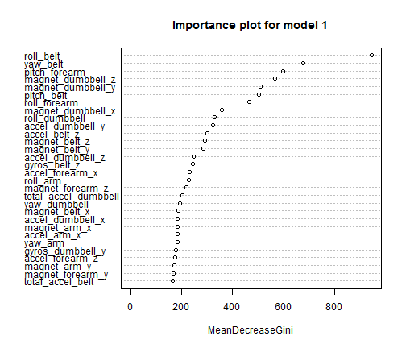

## Machine Learning Project

### Overview
This report presents the machine learning algorithms used for the course project. Two algorithms are presented.
* The first algoritm presents a simple random forest model using default parameters except for the number of trees was increased to 1000
* The second model used the caret package to generate a random forest with 3 passes of 10 fold cross-validation


### Background
Using devices such as Jawbone Up, Nike FuelBand, and Fitbit it is now possible to collect a large amount of data about personal activity relatively inexpensively. These type of devices are part of the quantified self movement - a group of enthusiasts who take measurements about themselves regularly to improve their health, to find patterns in their behavior, or because they are tech geeks. One thing that people regularly do is quantify how much of a particular activity they do, but they rarely quantify how well they do it. In this project, your goal will be to use data from accelerometers on the belt, forearm, arm, and dumbell of 6 participants. They were asked to perform barbell lifts correctly and incorrectly in 5 different ways. More information is available from the website here: http://groupware.les.inf.puc-rio.br/har (see the section on the Weight Lifting Exercise Dataset). 

### Environment setup

```r
# load libraries
library(caret)
library(randomForest)
```


### Data sourcing
The data for this project come from this source: http://groupware.les.inf.puc-rio.br/har. If you use the document you create for this class for any purpose please cite them as they have been very generous in allowing their data to be used for this kind of assignment.

```r
# load data sets training data -
# https://d396qusza40orc.cloudfront.net/predmachlearn/pml-training.csv
# training <-
# read.csv('E:/rprojects/machineLearning/project/rawdata/pml-training.csv')

# testing data -
# https://d396qusza40orc.cloudfront.net/predmachlearn/pml-testing.csv
# testing <-
# read.csv('E:/rprojects/machineLearning/project/rawdata/pml-testing.csv')
```


### Data cleaning and subsetting
A review of the dataset revealed that many of the variables either have no data (all records NA) or are sparsely populated i.e. less than 5% of records have reported values.
  
I decided to review the training set variables and see what variables were available for use as predictors. Variables with no data were identified and subsetted out of the testing set. The same variables were subset out of the training set.  
  
The number of variables available for predictors decreased from 159 to 59.

```r
## look at variables we have available in testing set since some variables in
## training set are sparsely populated (i.e. only 3% of records in 20,000
## have data) drop 'NA' columns from testing set and then drop corresponding
## columns from training set

# select columns in testing set which have no data recorded i.e all records
# reported as NA
noNAcol <- colSums(is.na(testing)) < 1 * nrow(testing)

# remove columns from testing with all of rows are NA's
testing.noNAcol <- testing[, noNAcol]
# summary(testing.noNAcol)

# remove corresponding column names from training set
training.noNAcol <- training[, noNAcol]
# summary(training.noNAcol)

## remove records with NA's (if any)
training.noNAcol <- na.omit(training.noNAcol)
testing.noNAcol <- na.omit(testing.noNAcol)
```


### Predictor selection
I decided to use all variables in the data set (excluding identification and index variables) as predictors.  
The following variables were considered to be identification and index variables and have not been used as predictors.  
'user_name' is considered to be an ID variable although it could be used as a predictor

```r
names(training.noNAcol[,1:7])
```

```
## [1] "X"                    "user_name"            "raw_timestamp_part_1"
## [4] "raw_timestamp_part_2" "cvtd_timestamp"       "new_window"          
## [7] "num_window"
```

```r
# remove id variables and index variables
# str(training.noNAcol)
train <- training.noNAcol[,c(8:60)]; # str(train) # note: have considered 'username' an id variable, so dropped
test <- testing.noNAcol[,c(8:59)]
```


### Create training and validation sets
80% of the training data was assigned to the training set and the remaining 20% of the training records were assigned to a validation set. The data sets used for modelling are as follows:  
* training set = 14718 records
* validation set = 4904 records
* testing set = 20 records
  
It is worth mentioning the training set has approximately 700 time the number of records of the testing set.

```r
# create train and validation datasets from train data (80:20)
set.seed(123)
inTrain <- createDataPartition(y = train$classe, p = 0.75, list = FALSE)
trainSet <- train[inTrain, ]
dim(trainSet)
```

```
## [1] 14718    53
```

```r
validationSet <- train[-inTrain, ]
dim(validationSet)
```

```
## [1] 4904   53
```


### Prediction models
### Model 1: Random Forest model
#### Generate model
A random forest model using all  'populated' variables (with data) less the 1st 7 variables in the data set which are either indentifier and indexing variables.  
Default model parameters we used except the number of trees was increased from the default of 500 to 1000 using the ntree parameter.  
The model is presented below:

```r
set.seed(123)
# fit <- randomForest(classe ~ ., data=trainSet, ntree = 1000) # use cached
# model
print(fit)  # view results
```

```
## 
## Call:
##  randomForest(formula = classe ~ ., data = trainSet, ntree = 1000) 
##                Type of random forest: classification
##                      Number of trees: 1000
## No. of variables tried at each split: 7
## 
##         OOB estimate of  error rate: 0.5%
## Confusion matrix:
##      A    B    C    D    E class.error
## A 4182    2    0    0    1   0.0007168
## B   10 2834    4    0    0   0.0049157
## C    0   16 2545    6    0   0.0085703
## D    0    0   23 2388    1   0.0099502
## E    0    0    2    8 2696   0.0036955
```


#### Out of bag error rate
In Breiman's original implementation of the random forest algorithm, each tree is trained on about 2/3 of the total training data. As the forest is built, each tree can thus be tested (similar to leave one out cross validation) on the samples not used in building that tree. This is the out of bag error estimate - an internal error estimate of a random forest as it is being constructed.  
source: http://stackoverflow.com/questions/18541923/what-is-out-of-bag-error-in-random-forests

Cross Validation and OOB error, have almost the same strategy for achieving misclassifcation error, but in my experience, cross validation criteria is much more reliable than the OOB error. Regarding the OOB error as an estimate of the test error : Remember, even though each tree in the forest is trained on a subset of the training data, all the training data is still eventually used to build the forest. So there still is some bias towards the training data. That's why something like cross validation is a more accurate estimate of test error - your not using all of the training data to build the model.
source: http://www.kaggle.com/c/titanic-gettingStarted/forums/t/3554/implications-of-out-of-bag-oob-error-in-random-forest-models/19440  
  
It is clear from the above statements that cross validation of the random forest model result in a lower misclassification rate.  
The OOB estimate of error for model 1 is reported as: 0.5% (using 'print(fit)' command).  
A training set accuracy of 100% was achieved. A validation set accuracy of 99.5% was achieved


#### Importance of variables
Gini is defined as "inequity" when used in describing a society's distribution of income, or a measure of "node impurity" in tree-based classification. A low Gini (i.e. higher descrease in Gini) means that a particular predictor variable plays a greater role in partitioning the data into the defined classes. It's a hard one to describe without talking about the fact that data in classification trees are split at individual nodes based on values of predictors.  
source: http://stackoverflow.com/questions/736514/r-random-forests-variable-importance

```r
importance1 <- as.data.frame(importance(fit))
importance1$Variable <- rownames(importance1)
rownames(importance1) <- NULL
importance1 <- importance1[order(-importance1$MeanDecreaseGini), ]
head(importance1, 10)  # importance of each predictor (first ten)
```

```
##    MeanDecreaseGini          Variable
## 1             945.7         roll_belt
## 3             675.5          yaw_belt
## 41            596.8     pitch_forearm
## 39            565.0 magnet_dumbbell_z
## 38            510.0 magnet_dumbbell_y
## 2             502.7        pitch_belt
## 40            464.2      roll_forearm
## 37            358.4 magnet_dumbbell_x
## 27            328.5     roll_dumbbell
## 35            322.3  accel_dumbbell_y
```

```r
varImpPlot(fit, main = "Importance plot for model 1")
```

 


#### predictions on training and validation sets

```r
# predictions on training set
predFit <- predict(fit); # predFit

# confusion matrix; from caret package
confusionMatrix(trainSet$classe, predFit)
```

```
## Confusion Matrix and Statistics
## 
##           Reference
## Prediction    A    B    C    D    E
##          A 4182    2    0    0    1
##          B   10 2834    4    0    0
##          C    0   16 2545    6    0
##          D    0    0   23 2388    1
##          E    0    0    2    8 2696
## 
## Overall Statistics
##                                         
##                Accuracy : 0.995         
##                  95% CI : (0.994, 0.996)
##     No Information Rate : 0.285         
##     P-Value [Acc > NIR] : <2e-16        
##                                         
##                   Kappa : 0.994         
##  Mcnemar's Test P-Value : NA            
## 
## Statistics by Class:
## 
##                      Class: A Class: B Class: C Class: D Class: E
## Sensitivity             0.998    0.994    0.989    0.994    0.999
## Specificity             1.000    0.999    0.998    0.998    0.999
## Pos Pred Value          0.999    0.995    0.991    0.990    0.996
## Neg Pred Value          0.999    0.998    0.998    0.999    1.000
## Prevalence              0.285    0.194    0.175    0.163    0.183
## Detection Rate          0.284    0.193    0.173    0.162    0.183
## Detection Prevalence    0.284    0.194    0.174    0.164    0.184
## Balanced Accuracy       0.999    0.996    0.993    0.996    0.999
```

```r

# predictions on validation set
predVal <- predict(fit, newdata = validationSet)

# confusion matrix; from caret package
confusionMatrix(validationSet$classe, predVal)
```

```
## Confusion Matrix and Statistics
## 
##           Reference
## Prediction    A    B    C    D    E
##          A 1394    1    0    0    0
##          B    1  946    2    0    0
##          C    0    8  846    1    0
##          D    0    0    9  793    2
##          E    0    0    0    1  900
## 
## Overall Statistics
##                                         
##                Accuracy : 0.995         
##                  95% CI : (0.992, 0.997)
##     No Information Rate : 0.284         
##     P-Value [Acc > NIR] : <2e-16        
##                                         
##                   Kappa : 0.994         
##  Mcnemar's Test P-Value : NA            
## 
## Statistics by Class:
## 
##                      Class: A Class: B Class: C Class: D Class: E
## Sensitivity             0.999    0.991    0.987    0.997    0.998
## Specificity             1.000    0.999    0.998    0.997    1.000
## Pos Pred Value          0.999    0.997    0.989    0.986    0.999
## Neg Pred Value          1.000    0.998    0.997    1.000    1.000
## Prevalence              0.284    0.195    0.175    0.162    0.184
## Detection Rate          0.284    0.193    0.173    0.162    0.184
## Detection Prevalence    0.284    0.194    0.174    0.164    0.184
## Balanced Accuracy       0.999    0.995    0.992    0.997    0.999
```


##### make predictions on test data

```r
predict(fit, newdata = test)
```

```
##  1  2  3  4  5  6  7  8  9 10 11 12 13 14 15 16 17 18 19 20 
##  B  A  B  A  A  E  D  B  A  A  B  C  B  A  E  E  A  B  B  B 
## Levels: A B C D E
```


### Model 2: Randomforest with 3 repeats of 10-fold cross validation (using caret package)
#### Generate model
A random forest model using all 'populated' variables (with data) less the 1st 7 variables in the data set which are either indentifier and indexing variables.  
  
A better model with less overfitting might be possible by using cross validation. The train command in the caret package was used to build a model with 3 repeats of 10-fold cross validation. All other parameters were defaults.
  
The model takes a long time to run (30+ minutes). No attempt was made for feature selection of the variables  

```r
# use caret package for cross validation 10 fold
set.seed(123)
cvCtrl <- trainControl(method = "repeatedcv", repeats = 3)  # use three repeats of 10-fold cross-validation
# model.fit <- train(classe ~ ., data = trainSet, method = 'rf', trControl =
# cvCtrl) # model takes 1 hour to generate so use cached version in project
# .RData file
model.fit
```

```
## Random Forest 
## 
## 14718 samples
##    52 predictors
##     5 classes: 'A', 'B', 'C', 'D', 'E' 
## 
## No pre-processing
## Resampling: Cross-Validated (10 fold, repeated 3 times) 
## 
## Summary of sample sizes: 13246, 13247, 13244, 13245, 13246, 13245, ... 
## 
## Resampling results across tuning parameters:
## 
##   mtry  Accuracy  Kappa  Accuracy SD  Kappa SD
##   2     1         1      0.002        0.002   
##   30    1         1      0.002        0.003   
##   50    1         1      0.003        0.004   
## 
## Accuracy was used to select the optimal model using  the largest value.
## The final value used for the model was mtry = 2.
```

```r
model.fit$finalModel
```

```
## 
## Call:
##  randomForest(x = x, y = y, mtry = param$mtry) 
##                Type of random forest: classification
##                      Number of trees: 500
## No. of variables tried at each split: 2
## 
##         OOB estimate of  error rate: 0.63%
## Confusion matrix:
##      A    B    C    D    E class.error
## A 4183    2    0    0    0   0.0004779
## B   15 2824    9    0    0   0.0084270
## C    0   16 2547    4    0   0.0077912
## D    0    0   40 2371    1   0.0169983
## E    0    0    0    6 2700   0.0022173
```


#### predictions on training and validation sets

```r
# predictions on training set
predictions.rf <- predict(model.fit); # predictions.rf

# confusionMatrix on training set
confusionMatrix(trainSet$classe, predictions.rf)
```

```
## Confusion Matrix and Statistics
## 
##           Reference
## Prediction    A    B    C    D    E
##          A 4185    0    0    0    0
##          B    0 2848    0    0    0
##          C    0    0 2567    0    0
##          D    0    0    0 2412    0
##          E    0    0    0    0 2706
## 
## Overall Statistics
##                                 
##                Accuracy : 1     
##                  95% CI : (1, 1)
##     No Information Rate : 0.284 
##     P-Value [Acc > NIR] : <2e-16
##                                 
##                   Kappa : 1     
##  Mcnemar's Test P-Value : NA    
## 
## Statistics by Class:
## 
##                      Class: A Class: B Class: C Class: D Class: E
## Sensitivity             1.000    1.000    1.000    1.000    1.000
## Specificity             1.000    1.000    1.000    1.000    1.000
## Pos Pred Value          1.000    1.000    1.000    1.000    1.000
## Neg Pred Value          1.000    1.000    1.000    1.000    1.000
## Prevalence              0.284    0.194    0.174    0.164    0.184
## Detection Rate          0.284    0.194    0.174    0.164    0.184
## Detection Prevalence    0.284    0.194    0.174    0.164    0.184
## Balanced Accuracy       1.000    1.000    1.000    1.000    1.000
```

```r

# predictions on validation set
predVal <- predict(model.fit, newdata = validationSet)

# confusion matrix on validation set
confusionMatrix(validationSet$classe, predVal)
```

```
## Confusion Matrix and Statistics
## 
##           Reference
## Prediction    A    B    C    D    E
##          A 1394    1    0    0    0
##          B    2  945    2    0    0
##          C    0    7  848    0    0
##          D    0    0   19  783    2
##          E    0    0    0    1  900
## 
## Overall Statistics
##                                        
##                Accuracy : 0.993        
##                  95% CI : (0.99, 0.995)
##     No Information Rate : 0.285        
##     P-Value [Acc > NIR] : <2e-16       
##                                        
##                   Kappa : 0.991        
##  Mcnemar's Test P-Value : NA           
## 
## Statistics by Class:
## 
##                      Class: A Class: B Class: C Class: D Class: E
## Sensitivity             0.999    0.992    0.976    0.999    0.998
## Specificity             1.000    0.999    0.998    0.995    1.000
## Pos Pred Value          0.999    0.996    0.992    0.974    0.999
## Neg Pred Value          0.999    0.998    0.995    1.000    1.000
## Prevalence              0.285    0.194    0.177    0.160    0.184
## Detection Rate          0.284    0.193    0.173    0.160    0.184
## Detection Prevalence    0.284    0.194    0.174    0.164    0.184
## Balanced Accuracy       0.999    0.995    0.987    0.997    0.999
```


#### Error rate - training and validation
The 'out of bag' error has incresed from 0.5% for model 1 to 0.63% for model 2, suggesting the model is now less likely to be overfitted to the training set. However, a training set accuracy of 100% is achieved.  

The correct classification rate (accuracy) on the validation set decreased from 99.5% for model 1 to 99.3% with a 95% confidence interval of 99% to 99.5%.


#### make predictions on test data
The following predictions were generated by running the test set using model 2.  
The test predictions were submitted and a score of 20/20 was achieved

```r
# predictions on test set
predictions.rf.cv.test <- predict(model.fit, newdata = test)
predictions.rf.cv.test
```

```
##  [1] B A B A A E D B A A B C B A E E A B B B
## Levels: A B C D E
```


